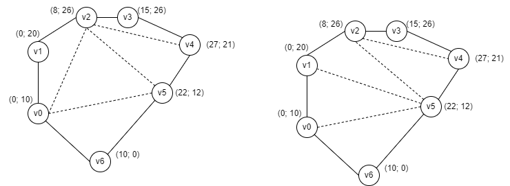
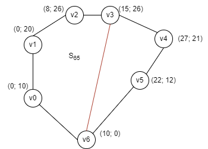
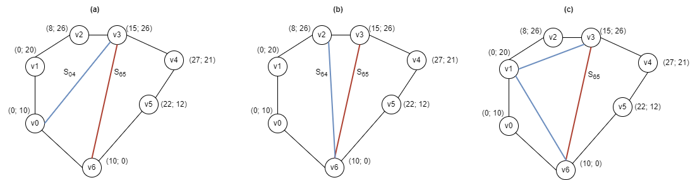
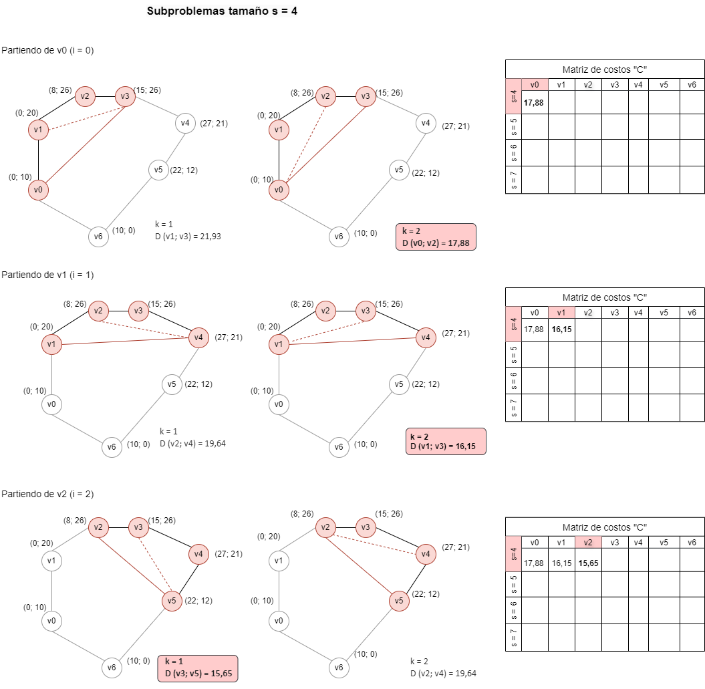
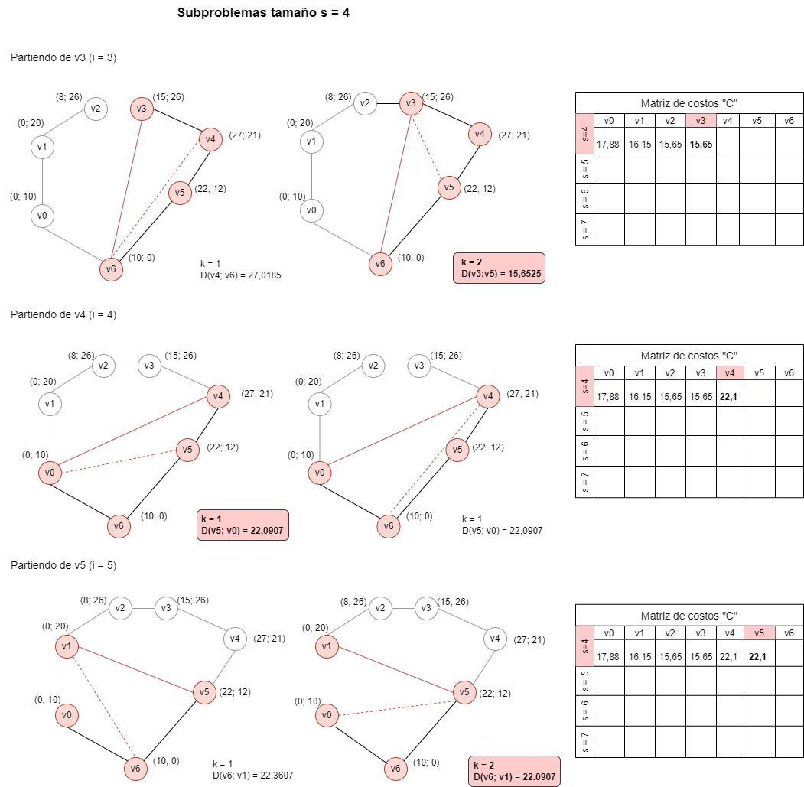
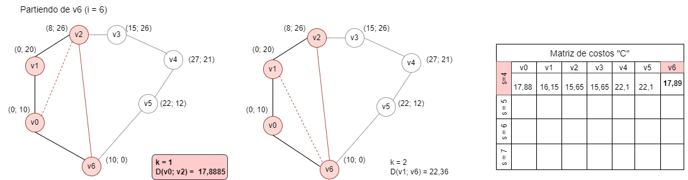
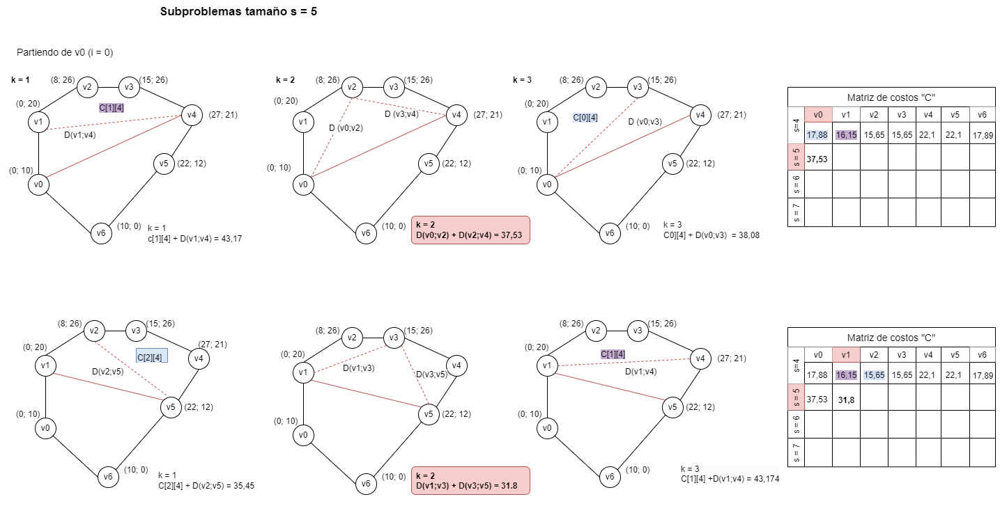

# Triangulación minimal de polígonos convexos

[Explicación previa](https://github.com/FlorenciaRodriguez/2024_AyDA1/tree/main/Dinamica#readme)


Dados los vértices de un polígono convexo se trata de seleccionar un conjunto de cuerdas (líneas entre vértices no adyacentes) de modo que ningún par de cuerdas se cruce entre sí y que todo el polígono quede dividido en triángulos. Además, la longitud total de las cuerdas debe ser mínima (triangulación minimal).

Utilidad: se puede emplear para sombrear objetos tridimensionales en una imagen virtual (bidimensional).

// poner una imagen que sea mas distinta de la de lal lado



- Tenemos un polígono P definido como un conjunto de N vértices ordenados en sentido antihorario P = <v<sub>0</sub>, v<sub>1</sub>, \... , v<sub>n-1</sub>>

- En toda triangulación de un polígono de más de 3 vértices, cada par de vértices adyacentes es tocado al menos por una diagonal. Si v<sub>i</sub> y v<sub>j</sub> no son adyacentes, entonces el segmento v<sub>i</sub>; v<sub>i</sub> es una cuerda.
  
- Si v<sub>i</sub> y v<sub>j</sub> definen una diagonal (v<sub>i</sub>, v<sub>j</sub>) debe existir un v<sub>k</sub> / (v<sub>i</sub>,v<sub>k</sub>) y (v<sub>k</sub>,v<sub>j</sub>) son lados o diagonal (i, j, k < N && v<sub>i</sub>, v<sub>j</sub>, v<sub>k</sub> ∈ P)
  
- Si v<sub>i</sub> y v<sub>j</sub> son lados del poligono, la distancia es cero.
  
## Subestructura óptima

Sea S<sub>i,s</sub> el subproblema de tamaño s partiendo del vértice v<sub>i</sub>, es decir, el problema de la triangulación
minimal del polígono formado por los s vértices que comienzan en v<sub>i</sub> y siguen en el sentido de las agujas del reloj (v<sub>i</sub>, v<sub>i+1</sub>, \..., v<sub>i+s-1</sub>), contando con la cuerda (v<sub>i</sub>,v<sub>i</sub>).



Ahora, para triangular el polígono S<sub>i,s</sub>, hay tres posibilidades: 



a) Tomar el vértice v<sub>i+1</sub> para formar un triángulo con las cuerdas (v<sub>i</sub>,v<sub>i+s-1</sub>) y (v<sub>i+1</sub>,v<sub>i+s-1</sub>) y con el tercer lado (v<sub>i</sub>,v<sub>i+1</sub>), y después resolver el subproblema S<sub>i+1,s-1</sub>. 

b) Tomar el vértice v<sub>i+s-2</sub> para formar un triángulo con las cuerdas (v<sub>i</sub>,v<sub>i+s-1</sub>) y (v<sub>i</sub>,v<sub>i+s-2</sub>) y con el tercer lado (v<sub>i+s-2</sub>,v<sub>i+s-1</sub>), y después resolver el subproblema S<sub>i,s-1</sub>. 

c) Para algún k entre 2 y s-3, tomar el vértice v<sub>i+k</sub> y formar un triángulo con lados (v<sub>i</sub>,v<sub>i+k</sub>), (v<sub>i+k</sub>,v<sub>i+s-1</sub>) y (v<sub>i</sub>,v<sub>i+s-1</sub>), y después resolver los subproblemas S<sub>i,k+1</sub>y S<sub>i+k,s-k</sub>.

Por tanto, si denotamos por C<sub>i,s</sub> el coste de la triangulación S<sub>i,s</sub>, se obtiene la siguiente formula: 

C<sub>i,s</sub>= min<sub>1≤k≤s−2</sub>C<sub>i,k+1</sub> +{ C<sub>i+k,s-k</sub> +D(v<sub>i</sub> ,v<sub>i+k</sub>) +D(v<sub>i+k</sub> ,v<sub>i+s-1</sub>)}
para 0≤i≤N-1, 4≤s≤N; 

donde: D(v<sub>p</sub>,v<sub>q</sub>) es la longitud de la cuerda entre los vértices v<sub>p</sub> y v<sub>q</sub>


si v<sub>p</sub> y v<sub>q</sub> no son vértices adyacentes en el polígono P; y D(v<sub>p</sub>,v<sub>q</sub>) es 0 si v<sub>p</sub> y v<sub>q</sub> son adyacentes. Además, C<sub>i,s</sub> = 0 para 0≤i≤N-1, 2≤s<4.

### Subproblemas superpuestos 

Los subproblemas se superponen porque el cálculo de la triangulación mínima de un subpolígono de v<sub>i</sub> a v<sub>j</sub> puede requerir resolver los mismos subproblemas múltiples veces.

### Reconstrucción de la solución óptima 

Utilizamos matrices para reconstruir la solución óptima.

## Seguimiento para el polígono dado (hasta s = 5, i =2)









// Continuar 

## Triangulación

Para cada posición (i,s) de la tabla se necesita almacenar, además del costo, el valor del índice k que produjo el mínimo.

Entonces la solución consta de las cuerdas (v<sub>i</sub>,v<sub>i+k</sub>) y (v<sub>i+k</sub>,v<sub>i+s-1</sub>) (a menos que una de ellas no sea cuerda, porque k=1 o k=s-2), más las cuerdas que generadas por las soluciones de S<sub>i,k+1</sub> y S<sub>i+k,s-k</sub>.

## Alternativas de implementación

1. Se puede utilizar una matriz de distancias D, en lugar de invocar al método getDistancia de la clase Punto.
Entonces, las líneas siguientes:

```cpp
double d1 = (k!=1) ? pi.getDistancia(pk) : 0;
double d2 = (x != (ultimo-1) ) ? pk.getDistancia(ps) : 0;
```

Son reemplazadas por:

```cpp
double d1 = (k != 1) ? D[i][k];
double d2 = (x != (ultimo-1) ) ? D[k][s];
```

*Para analizar:*

- El getDistancia tiene operaciones aritméticas complejas, como la raíz cuadrada y la potencia. Pueden no ser del orden constante. En ese caso sería mejor la matriz.
  
- Al tener la matriz, no tenemos el costo espacial de los objetos de la clase Punto, p<sub>i</sub>, p<sub>k</sub> y p<sub>s</sub>, pero caemos en un costo espacial de almacenamiento de la matriz. Además del costo de inicialización.
  
- Al tener la matriz calculamos una sola vez la distancia entre dos puntos.

# Código con matriz de distancias

```cpp
// Si hay varios llamados a la función, es más eficiente pasar la matriz por parámetro.
// En este caso creamos la matriz dentro de la función porque la vamos a invocar una sola vez.
int** Poligono::incializarDistancias () const
{
  D = new int*[this->cantidad];
  for (int i = 0; i < this->cantidad; i++)
  {
    D[i] = new int [this->cantidad];
    const Punto & pi = this->vertices[i];
    for (int j = 0;j < this->cantidad; j++)
      D[i][j] = ((i == j) || (i+1 == j)) ? 0 : pi.getDistancia(this->vertices[j]); 
  }
  return D;
}

double Poligono::costoTriangulacion() const{
    
    int ** D = incializarDistancias();
    double ** c = new double*[this->cantidad-3];

    for (int s = 4; s <= this->cantidad; s++)
    {
        c[s-4] = new double[this->cantidad];
        for (int i=0; i< this->cantidad; i++)
        {
            int ultimo = (s+i-1)%this->cantidad;
            c[s-4][i] = MAX;
            for (int k=1; k<= s-2; k++)
            {
                int x = (i+k)%this->cantidad;
                double c1 = (k+1>=4) ? c[k-3][i] : 0;
                double c2 = (s-k>=4) ? c[s-k-4][x] : 0;
                double d1 = (k!=1) ? D[i][s] : 0;
                double d2 = (x != (ultimo-1) ) ? D[k][s] : 0;
                double costo_k = c1 + c2 + d1 + d2;
                if (costo_k < c[s-4][i])      
                    c[s-4][i] = costo_k;
            }
        }
    }
    double costo = c[this->cantidad-4][0];

    // se puede modularizar
    int i = 0;
    while (i<this->cantidad-3){
        delete D[i];
        delete c[i];
        i++;
    }
    while (i<this->cantidad){
        delete D[i];
        i++;
    }

    delete c;
    delete D;

    return costo;
}
```


2. Se puede utilizar la matriz de costos de N * (N+1). Las filas menores a 4 deben tener 0:

```cpp
double Poligono::costoTriangulacion() const{
    
    double ** c = new double*[this->cantidad+1];

    // Primeras tres filas de matriz de costos, con 0
    for (int s = 0; s < 4; s++)
    {
      c[s] = new double[this->cantidad];
      for (int i = 0; i< this->cantidad; i++)
        c[s][i] = 0;
    }

    for (int s = 4; s <= this->cantidad; s++)
    {    
        c[s] = new double[this->cantidad];
        for (int i=0; i< this->cantidad; i++)
        {
            const Punto & pi = this->vertices[i];
            const Punto & ps = this->vertices[ultimo];
            int ultimo = (s+i-1)%this->cantidad;
            c[s][i] = MAX;
            for (int k=1; k<= s-2; k++)
            {
                int x = (i+k)%this->cantidad;
                const Punto & pk = this->vertices[x];
                double c1 = c[k-3][i];
                double c2 = c[s-k-4][x];
                double d1 = (k!=1) ? pi.getDistancia(pk) : 0;
                double d2 = (x != (ultimo-1) ) ? pk.getDistancia(ps) : 0;
                double costo_k = c1 + c2 + d1 + d2;
                if (costo_k < c[s][i])      
                    c[s][i] = costo_k;
            }
        }
    }
    double costo = c[this->cantidad][0];

    for (int i=0;i<=this->cantidad;i++){
        delete c[i];
    }
    delete c;

    return costo;
}
```
// Revisar soluciones
// Chequear tabla. Pegarla
// Revisar ortografía
// poner complejidades
// avisar para que alguien revise esto
