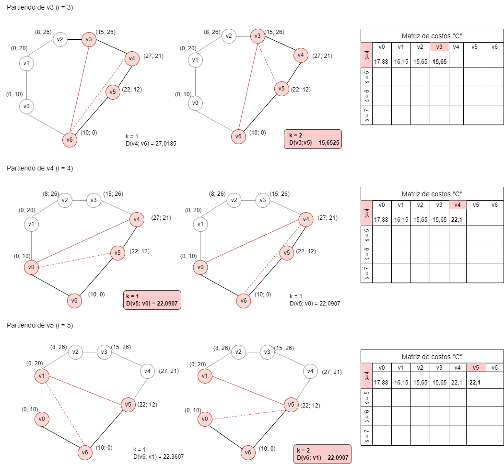

# Triangulación minimal de polígonos convexos

[Explicación previa](https://github.com/FlorenciaRodriguez/2024_AyDA1/tree/main/Dinamica#readme)

Dados los vértices de un polígono convexo se trata de seleccionar un conjunto de cuerdas (líneas entre vértices no adyacentes) de modo que ningún par de cuerdas se cruce entre sí y que todo el polígono quede dividido en triángulos. Además, la longitud total de las cuerdas debe ser mínima (triangulación minimal).

Utilidad: se puede emplear para sombrear objetos tridimensionales en una imagen virtual (bidimensional).

- Tenemos un polígono P definido como un conjunto de N vértices ordenados en sentido antihorario P = <v0, v1, \... , vn-1>

- En toda triangulación de un polígono de más de 3 vértices, cada par de vértices adyacentes es tocado al menos por una diagonal. Si vi y vj no son adyacentes, entonces el segmento vi; vi es una cuerda.
  
- Si vi y vj definen una diagonal (vi, vj) debe existir un vk / (vi,vk) y (vk,vj) son lados o diagonal (i, j, k < N && vi, vj, vk ∈ P)
  
- Si vi y vj son lados del poligono, la distancia es cero.
  
## Subestructura óptima

Sea Si,s el subproblema de tamaño s partiendo del vértice vi, es decir, el problema de la triangulación
minimal del polígono formado por los s vértices que comienzan en vi y siguen en el sentido de las agujas del reloj (vi, vi+1, \..., vi+s-1), contando con la cuerda (vi,vi).

Ahora, para triangular el polígono Si,s, hay tres posibilidades: 

a) Tomar el vértice vi+1 para formar un triángulo con las cuerdas (vi,vi+s-1) y (vi+1,vi+s-1) y con el tercer lado (vi,vi+1), y después resolver el subproblema Si+1,s-1. 

b) Tomar el vértice vi+s-2 para formar un triángulo con las cuerdas (vi,vi+s-1) y (vi,vi+s-2) y con el tercer lado (vi+s-2,vi+s-1), y después resolver el subproblema Si,s-1. 

c) Para algún k entre 2 y s-3, tomar el vértice vi+k y formar un triángulo con lados (vi,vi+k), (vi+k,vi+s-1) y (vi,vi+s-1), y después resolver los subproblemas Si,k+1y Si+k,s-k.

Por tanto, si denotamos por Ci,s el coste de la triangulación Si,s, se obtiene la siguiente formula: 

Ci,s= min1≤k≤s−2Ci,k+1 +{ Ci+k,s-k +D(vi ,vi+k) +D(vi+k ,vi+s-1)}
para 0≤i≤N-1, 4≤s≤N; 

donde: D(vp,vq) es la longitud de la cuerda entre los vértices vp y vq

si vp y vq no son vértices adyacentes en el polígono P; y D(vp,vq) es 0 si vp y vq son adyacentes. Además, Ci,s = 0 para 0≤i≤N-1, 2≤s<4.

### Subproblemas superpuestos 

Los subproblemas se superponen porque el cálculo de la triangulación mínima de un subpolígono de vi a vj puede requerir resolver los mismos subproblemas múltiples veces.

### Reconstrucción de la solución óptima 

Utilizamos matrices para reconstruir la solución óptima.

## Seguimiento para el polígono dado (hasta s = 5, i =2)

